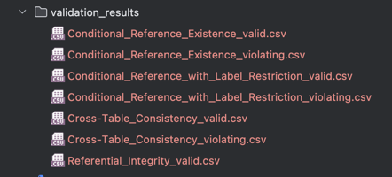

# Data Validation Rules System - Comprehensive Documentation

## Project Overview

This project is a high-performance data validation rules system designed to validate referential integrity, cross-table consistency, and conditional references between multiple data tables. The system leverages pandas vectorized operations for performance optimization, provides command-line batch processing capabilities, and reduces code duplication through modular design.
##### Output and Csv files
[output.txt](output/output.txt) validate_rules.py output

[test_output.txt](output/test_output.txt) --test.py output

[validation_results](validation_results)


## System Architecture

### Rule Abstraction

All rules inherit from the abstract base class `Rule`, which requires:

- `_validate_config()`: Validate the rule configuration
- `validate(dataset)`: Return indices of violating and valid rows
- `get_violation_report(dataset)`: Return detailed statistics
- `save_validation_results(dataset, output_dir)`: Save details to CSV

### Rule Types

- **rule1.py**: Referential Integrity
- **rule2.py**: Cross-Table Consistency
- **rule3.py**: Conditional Reference Existence 
- **rule4.py**: Conditional Reference with Label Restriction 

### Module Structure
```
common.py          # Shared infrastructure
├── Rule (ABC)     # Abstract base class
├── RuleFactory    # Factory class for rule instantiation
├── DataLoader     # Data loader for Excel files
└── RuleLoader     # Rule configuration loader

rule1.py          # Referential integrity rule
rule2.py          # Cross-table consistency rule  
rule3.py          # Conditional reference existence rule
rule4.py          # Conditional reference with label restriction
cli.py            # Command-line interface for batch processing
```

## Completed Tasks and Implementation Details

### 1. Performance Optimization - Using Pandas Vectorized Operations

#### Original Implementation Issues

The original code used row-by-row iteration for data validation, resulting in poor performance on large datasets.

#### Optimized Implementation

All rule validation logic has been rewritten using vectorized operations:

**ReferentialIntegrityRule Optimization Example:**

```python
# Using vectorized operations instead of loops
# 1. Use set for fast lookups
valid_references = set(right_df[right_column].dropna().unique())

# 2. Use pandas isin() method for batch checking
valid_ref_mask = left_df[left_column].isin(valid_references)

# 3. Use boolean masks for conditional filtering
valid_mask = null_mask | (non_null_mask & valid_ref_mask)
```

**CrossTableConsistencyRule Optimization Example:**

```python
# Use pandas merge for efficient joins
merged_df = pd.merge(
    left_df,
    right_df,
    left_on=left_join_col,
    right_on=right_join_col,
    suffixes=('_left', '_right'),
    how='inner'
)

# Use vectorized comparison
merged_df['is_consistent'] = (
    (merged_df[left_check_col_merged].isna() & merged_df[right_check_col_merged].isna()) |
    (merged_df[left_check_col_merged] == merged_df[right_check_col_merged])
)
```

**ConditionalReferenceExistence Optimization Example:**

```python
# Use string vectorized operations
condition_values = cond_df[condition_col].astype(str).str.lower()
if operator == 'contains':
    condition_met_mask = condition_values.str.contains(search_text, na=False)
else:
    condition_met_mask = condition_values == search_text
```

### 
All rule validation logic has been rewritten using vectorized operations, eliminating row-by-row loops:

**Key Optimization Techniques:**
- **Set-based lookups**: Using Python sets for O(1) membership checking
- **Boolean masking**: Leveraging pandas boolean indexing for efficient filtering
- **Vectorized string operations**: Using pandas string methods for text matching
- **Efficient joins**: Using pandas merge for cross-table operations


### 2. Code Deduplication - Modular Design

All shared code has been consolidated into `common.py`:

- **Rule Base Class**: Provides common interface and shared methods
- **RuleFactory**: Implements factory pattern for dynamic rule instantiation
- **DataLoader**: Unified Excel file loading with automatic table name mapping
- **RuleLoader**: JSON configuration file loading and parsing

### 3. Batch Processing & CLI

Complete command-line interface with extensive features:

```bash
python cli.py --data-dir ./data --json-dir ./json --output-dir ./results --rule-type all
```

**Arguments:**
- `--data-dir`: Directory containing Excel data files (default: current directory)
- `--json-dir`: Directory containing JSON rule configurations (default: json)
- `--output-dir`: Directory for validation results output (default: validation_results)
- `--rule-type`: Filter rules by type (all/referential/consistency/conditional/label-restriction)

**Features:**
- Automatic discovery and loading of all data files
- Batch execution of multiple rules
- Progress tracking and detailed logging
- Summary statistics and violation rankings

### 4. Testing Strategy

Test one of the json data of each rule type and the test result is correct

```python
# Example test structure
 def test_rule_1_referential_integrity(self):
        """
        Test Referential Integrity rule.

        Rule: Every responsabili.Codice_IPA must refer to an existing enti.Codice_IPA.

        Expected results based on test data:
        - Total rows: 20,518
        - Valid rows: 20,518
        - Violating rows: 0
        - Violation rate: 0.00%
        """
        self._run_rule_test(
            rule_config_file='json/test/test1.json',
            expected_total=20518,
            expected_valid=20518,
            expected_violating=0,
            expected_violation_rate=0.00,
            rule_display_name="Rule 1/4 (Referential Integrity)"
        )
```

## Input/Output Specifications

### Input Format

#### Dataset Structure
```python
dataset = {
    'uo': pd.DataFrame(...),              # Unità organizzative
    'enti': pd.DataFrame(...),            # Enti
    'responsabili': pd.DataFrame(...),    # Responsabili
    'uo_sfe': pd.DataFrame(...)           # UO che ricevono fatture
}
```

#### Rule Configuration Format
```json
{
    "rule_type": "Referential Integrity",
    "rule": "Every responsabili.Codice_IPA must refer to an existing enti.Codice_IPA",
    "explanation": "Ensures all responsible persons are associated with valid entities",
    "columns": [
        {"table": "responsabili", "name": "Codice_IPA"},
        {"table": "enti", "name": "Codice_IPA"}
    ],
    "join_pairs": [
        {
            "left": {"table": "responsabili", "name": "Codice_IPA"},
            "right": {"table": "enti", "name": "Codice_IPA"}
        }
    ]
}
```

### Output Format

Each validation produces CSV files in the `validation_results` directory:

- **Valid rows**: `{RuleType}_valid.csv` - Original data with `validation_status=valid`
- **Violating rows**: `{RuleType}_violating.csv` - Original data with `validation_status=violating`


Example output files:

###  Csv output result : [validation_results](validation_results)

## Usage Guide

### Quick Start


1**Batch Processing**
```bash
# Process all rules
python validate_rules.py 

# Process specific rule type
python validate_rules.py --rule-type referential

# Use custom directories
python validate_rules.py --data-dir ./mydata --json-dir ./myrules --output-dir ./myresults
```

### Data Preparation

1. **Excel Data Files**
Place Excel files in the data directory with expected names:
- `enti.xlsx`
- `unita-organizzative.xlsx`
- `responsabili-della-transizione-al-digitale.xlsx`
- `unita-organizzative-che-ricevono-fatture-elettroniche.xlsx`

2. **Rule Configuration Files**
Create JSON files in the json directory for each rule type.

## Key Features and Design Decisions

### Error Handling
- Graceful handling of missing tables/columns
- Detailed error messages with context
- Continuation of batch processing on individual rule failures

### Performance Features
- Vectorized operations throughout
- Efficient memory usage with boolean masks
- Set-based lookups for reference validation

### Extensibility
Easy to add new rule types:

```python
class MyNewRule(Rule):
    def _validate_config(self):
        # Validate configuration
        pass
    
    def validate(self, dataset):
        # Implement validation logic using vectorized operations
        violating_mask = dataset['table']['column'].isin(invalid_values)
        valid_rows = dataset['table'].index[~violating_mask].tolist()
        violating_rows = dataset['table'].index[violating_mask].tolist()
        return violating_rows, valid_rows

# Register the rule
RuleFactory.register_rule_type('My New Rule', MyNewRule)
```

## Example Function Documentation

```python
def validate(self, dataset: Dict[str, pd.DataFrame]) -> Tuple[List[int], List[int]]:
    '''
    Validate referential integrity rule using vectorized operations.

    Parameters:
        dataset: Dict[str, pd.DataFrame]
            Dictionary mapping table names to DataFrames

    Returns:
        Tuple[List[int], List[int]]
            - violating_rows: Indices of rows violating the rule
            - valid_rows: Indices of rows satisfying the rule


    '''
```

## Summary

this data validation system provides a robust, high-performance solution for validating complex business rules across multiple data tables. 